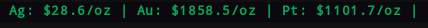

# polymetals
Custom polybar script that displays the price of silver, gold, platinum, palladium, and/or copper.

## Python Modules Needed
* 'pandas'
* 'argparse'
* 'requests_html'
* 'yahoo_fin'

## Module Example
```ini
[module/polymetals]
type = custom/script
; -s or --silver to display Silver
; -g or --gold to display Gold
; -p or --platinum to display Platinum
; -c or --copper to display Copper
; -a or --palladium to display Palladium
exec = ~/.config/polybar/scripts/polymetals/polymetals.py -a -c -p
tail = true
label = %output%
```
## Example


## How to Use
1. Download needed python modules.
2. Download polymetals.
3. Extract polymetals to your polybar folder, or your folder for polybar scripts.
4. Make polymetals.py executable.
5. Add the module to your polybar config, making sure the path is correct.
